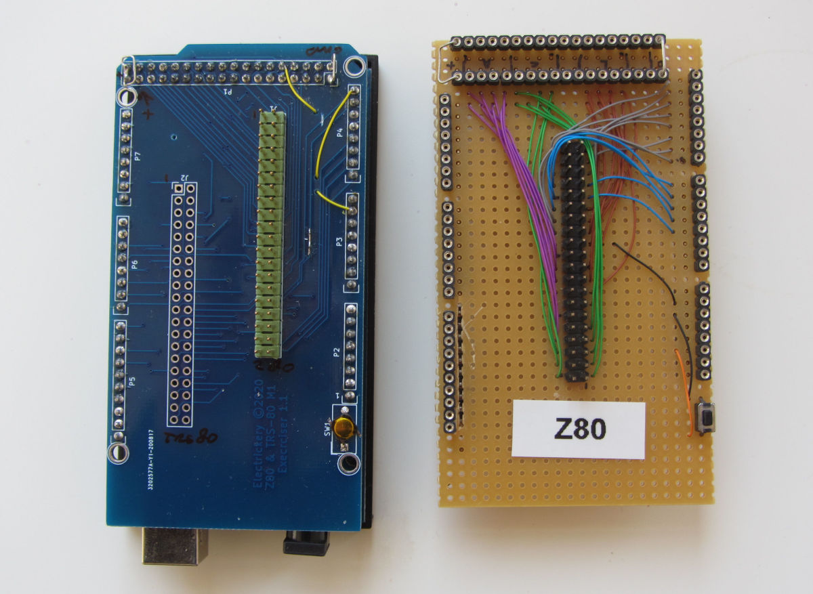

**Z80Exer - an Arduino based Z80 board exercizer

A long time ago (well 2014), I developed the original Z80Exersizer, to be able to check Z80 based boards from the Z80 CPU
socket. It worked and I announced this on the VCF-forum (then called vintagecomputer.org). Eventually I added some specific
features to test a TRS-80 Model 1, but mostly the project was halted.

At one time David Mutimer became interested and added the option to control the Model 1 from the expansion bus. Another feature was the much improved testing of the dynamic RAM.

Originally I used an experiment PCB between the Arduino Mega 2560, but with the TRS80 bus added this would get too complex, so in 2020 I created a shield, and included a connector for the TRS-80 connector to make it more versatile. The code was somewhat more optimized. The board is alas still not completely debugged.

Now the versions I still had in .tgz files are uploaded here in github, and the work of David Mutimer is in a separate branch DMutimer. It should be a clean merge.

Z80exer command set:

		-- Z80 exerciser 0.6beta command set --
		Aaaaa          - set address bus to value aaaa
		Bpp or B#ss    - blink pin p (in hex) or symbol: A0-AF,D0-D7,RD,WR.MQ,IQ,M1,RF,HT,BK
		D[ssss[-eeee]|+] - Dump memory from ssss to eeee (default 256 bytes)
		H              - This help text
		Issss-eeee     - Generate hex intel data records
		MRaaaa[+]      - Read memory address aaaa, optionally repeating
		MWaaaa vv[+]   - Write vv to address aaaa, optionally repeating
		PRaa[+]        - Read port address [aa]aa, optionally repeating
		PWaa:vv[+]     - Write vv to address [aa]aa, optionally repeating
                O              - Input Port map
		R[+|-]         - Refresh on/off
		Qn             - Repeat rate; 1, 2, 4, 8, 16, ..., 32678 ms (n=0-9,A-F)
		Sssss-eeee:vv  - fill a memory range with a value
		Tp             - exercise port p
		Ussss-eeee     - test RAM range (walking 1s)
		V              - view data bus, pins INT, NMI, WAIT, BUSRQ, RESET
		Wpp v or W#ss v - Write pin (in hex) or symbol: A0-AF,D0-D7,RD,WR.MQ,IQ,M1,RF,HT,BK; values 0, 1
		?              - This help text
		

The main page is at [Github](https://electrickery.nl/digaud/arduino/Z80exer/)
